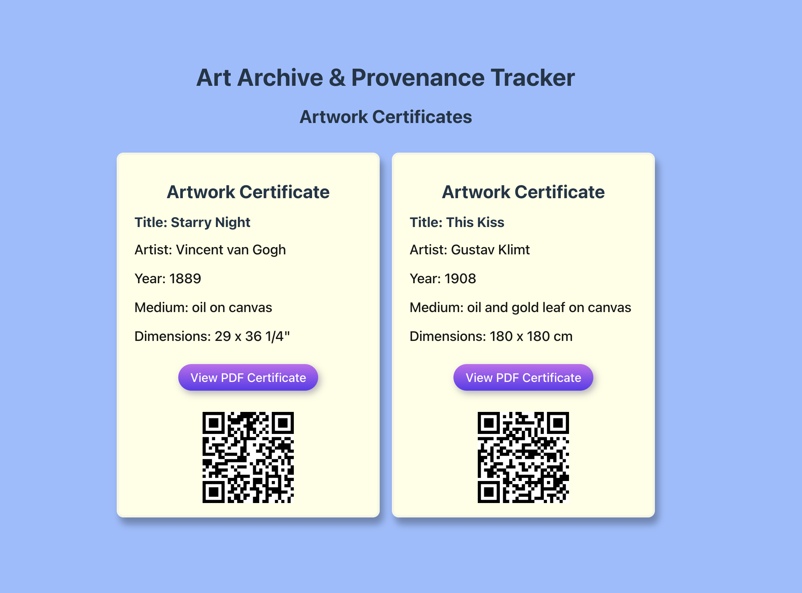

# Art Archive Frontend
A modern Vue 3 frontend for the Art Archive & Provenance Tracker system. This application was built to explore **QuestPDF** document generation and to implementa fully decoupled REST API architecture. It provides an intuitive interface for browsing artwork collections and viewing generated certificates of authenticity.

This frontend connects to the Art Archive API for all data operations.
Backend Repository: [art-archive-api](https://github.com/JJLindsey/art-archive-api)

### Features

- Artwork Browser - View and search artwork collections
- Certificate Viewer - Display PDF certificates in an interactive modal
- Responsive Design - Clean, modern UI that works on all devices
- PDF Download - Download certificates directly from the browser
- Real-time Preview - View certificates without leaving the application

### Tech Stack

- Vue 3 - Progressive JavaScript framework with Composition API
- Vite - Next-generation frontend build tool
- Axios - Promise-based HTTP client
- Modern CSS - Flexbox layouts and responsive design; No framework bloat for a straightforward UI

### Prerequisites

- Node.js (v16 or later)
- npm or yarn
- Running instance of art-archive-api

### Getting Started
- clone repo
- install dependencies
- configure API endpoints in .env

### Project Structure
```
art-archive-frontend/
├── src/
│   ├── components/
│   │   ├── ArtworkCard.vue
│   ├── views/
│   │   ├── GalleryView.vue
│   ├── api/
│   │   └── artworks.js
│   ├── App.vue
│   └── main.js
├── public/
├── .env
├── package.json
├── vite.config.js
└── README.md
```
### CORS Requirements
The backend API must be configured to allow requests from your frontend origin. See the backend repository for CORS configuration details.

### Architecture
This frontend follows a separation of concerns architecture:
```
┌─────────────────────┐
│   Vue 3 Frontend    │
│  (This Repository)  │
└──────────┬──────────┘
           │ HTTP/REST
           ▼
┌─────────────────────┐
│   ASP.NET Core API  │
│   (Separate Repo)   │
└──────────┬──────────┘
           │
           ▼
┌─────────────────────┐
│   SQLite Database   │
└─────────────────────┘
```
### Benefits:

- Independent deployment cycles
- Technology-agnostic API (can swap frontend frameworks)
- Clear API contracts
- Easier testing and maintenance
- Scalable architecture

### Artwork Collection View


### Certificate Modal with PDF Viewer


#### License
This project is licensed under the MIT License - see the LICENSE file for details.

### Contact